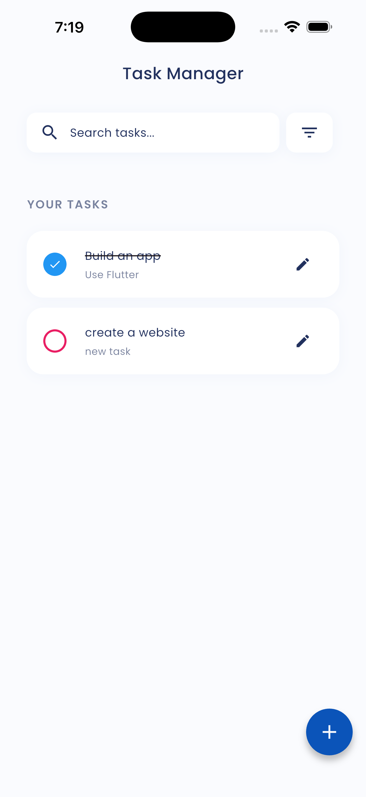
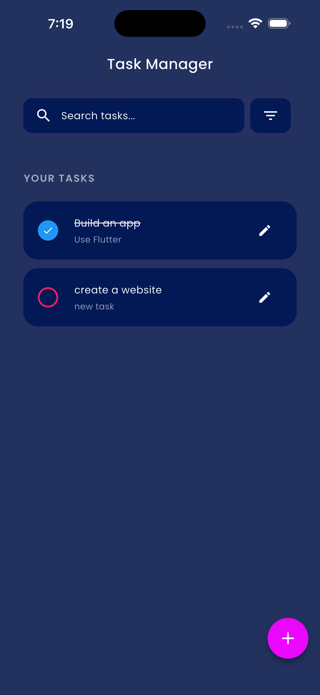
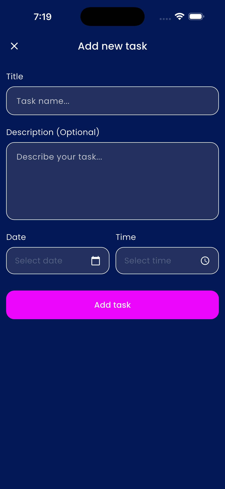
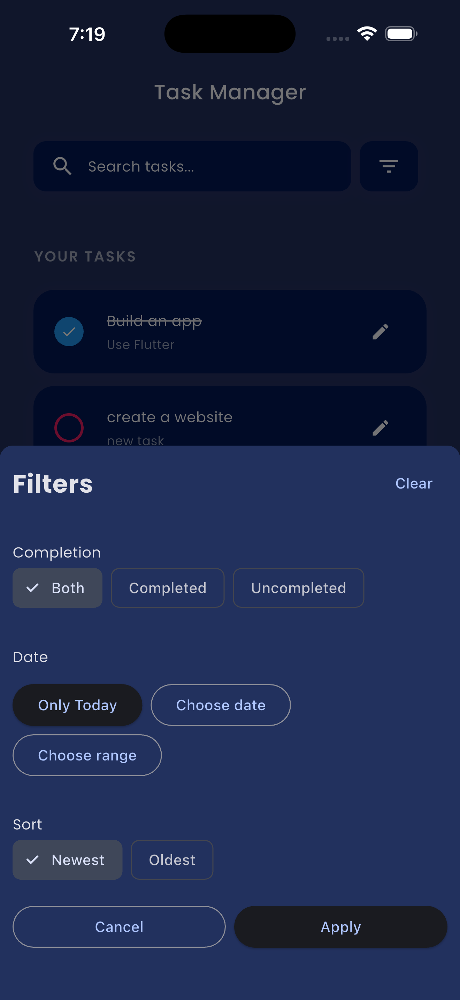
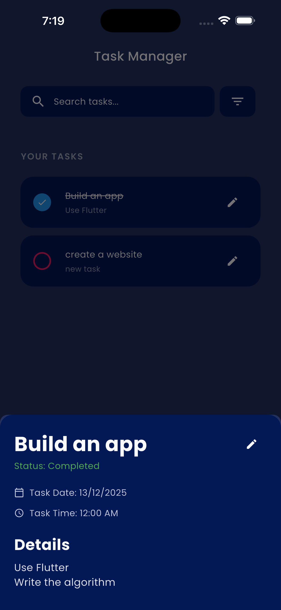

# Personal Task Manager

A Flutter mobile application for managing personal tasks with a clean architecture approach, demonstrating modern state management patterns and best practices.

## 📱 App Description

Personal Task Manager is a simple yet powerful task management application that allows users to create, edit, delete, and organize their daily tasks. The app features local data persistence, search functionality, and an intuitive user interface with proper loading and error states.

### Key Features

- ✅ **Task Management**: Create, read, update, and delete tasks
- 🔍 **Search Functionality**: Real-time search with debouncing (350ms)
- 📊 **Task Filtering**: Filter tasks by completion status and date
- 💾 **Data Persistence**: Local storage using Hive database
- ♻️ **Undo Delete**: Restore accidentally deleted tasks
- 🎨 **Responsive UI**: Clean interface with loading states and error handling
- 🌓 **Theme Support**: Light and dark mode support
- 📄 **Infinite Scroll**: Pagination support for large task lists (20 items per page)

## 🏗️ Architecture

This project implements **Clean Architecture** principles with a clear separation of concerns:

```
lib/
├── core/
│   └── theme/              # Theme system (colors, typography, spacing)
├── features/
│   └── task/
│       ├── data/           # Data layer
│       │   ├── data_sources/
│       │   │   └── task_data_source.dart       # Hive storage implementation
│       │   ├── models/
│       │   │   ├── task_model.dart             # Data model (Hive)
│       │   │   ├── task_query.dart             # Query parameters
│       │   │   └── task_data_source_exception.dart
│       │   └── repository/
│       │       └── task_repository.dart        # Repository implementation
│       ├── domain/         # Domain layer
│       │   ├── entities/
│       │   │   ├── task.dart                   # Business entity
│       │   │   └── result.dart                 # Result wrapper
│       │   ├── repository/
│       │   │   └── task_repository_interface.dart
│       │   └── use_cases/                      # Business logic
│       │       ├── create_task_use_case.dart
│       │       ├── update_task_use_case.dart
│       │       ├── delete_task_use_case.dart
│       │       ├── get_tasks_stream_use_case.dart
│       │       ├── search_tasks_use_case.dart
│       │       ├── filter_tasks_use_case.dart
│       │       └── ... (other use cases)
│       └── presentation/   # Presentation layer
│           ├── controllers/
│           │   ├── task_list_notifier.dart     # Task list state management
│           │   └── task_form_notifier.dart     # Form state management
│           ├── screens/
│           │   ├── home_screen.dart
│           │   └── add_task_screen.dart
│           └── widgets/
│               └── task_item.dart              # Task card widget
├── shared/
│   ├── widgets/            # Reusable UI components
│   └── utils/              # Utility functions
└── main.dart
```

### Architecture Layers

1. **Data Layer**
    - `TaskDataSource`: Direct interaction with Hive database
    - `TaskModel`: Data transfer object (DTO) with Hive annotations
    - `TaskRepository`: Implements repository pattern, wraps data source operations with error handling
    - Converts between `TaskModel` (data) and `Task` (domain entity)

2. **Domain Layer**
    - `Task`: Core business entity (immutable)
    - `Result<T>`: Wrapper for success/failure states
    - `TaskRepositoryInterface`: Contract for repository
    - **Use Cases**: Each business operation has its own use case class following Single Responsibility Principle
        - `CreateTaskUseCase`, `UpdateTaskUseCase`, `DeleteTaskUseCase`
        - `GetTasksStreamUseCase`, `SearchTasksUseCase`, `FilterTasksUseCase`
        - `ToggleTaskCompletionUseCase`, `ClearAllTasksUseCase`

3. **Presentation Layer**
    - **State Management**: Riverpod with `Notifier` pattern
    - `TaskListNotifier`: Manages task list state, pagination, search, and filters
    - `TaskFormNotifier`: Manages add/edit form state and validation
    - **Screens**: Home screen (task list) and Add/Edit task screen
    - **Widgets**: Reusable task item cards with swipe actions

### Design Patterns Used

- **Repository Pattern**: Abstracts data source implementation
- **Use Case Pattern**: Encapsulates business logic into single-purpose classes
- **Result Pattern**: Type-safe error handling without exceptions
- **Provider Pattern**: Dependency injection via Riverpod
- **Notifier Pattern**: State management with Riverpod's `Notifier` class
- **Stream Pattern**: Reactive data flow from data source to UI
- **Optimistic Updates**: Immediate UI feedback with rollback on error

## 🔄 State Management Approach

### Technology: **Riverpod 2.x**

I chose Riverpod for its:
- Type safety and compile-time error detection
- Better testing capabilities
- No context dependency for state access
- Excellent developer experience with code generation support

### State Management Architecture

#### 1. **TaskListNotifier** (Task List Screen)
```dart
class TaskListNotifier extends Notifier<TaskListState>
```

**Responsibilities:**
- Listens to task stream from repository
- Implements infinite scroll pagination (20 items per page)
- Handles search with debouncing (350ms)
- Manages filtering by completion status and date
- Optimistic UI updates for toggle/delete operations
- Error handling with user feedback

**State:**
```dart
class TaskListState {
  final List<Task> tasks;
  final bool isLoading;
  final bool isLoadingMore;
  final bool hasMore;
  final bool hasFilter;
  final String? error;
  final int currentPage;
}
```

#### 2. **TaskFormNotifier** (Add/Edit Screen)
```dart
class TaskFormNotifier extends Notifier<TaskFormState>
```

**Responsibilities:**
- Form validation
- Create/update operations
- Loading and success states
- Error handling

**State:**
```dart
class TaskFormState {
  final bool isLoading;
  final bool isSuccess;
  final String? error;
  final String? successMessage;
}
```

#### 3. **Stream-Based Reactivity**

The app uses a reactive stream architecture:

```
TaskDataSource._tasksStreamController
    ↓
TaskRepository.tasksStreamWithErrorHandling
    ↓
GetTasksStreamUseCase
    ↓
TaskListNotifier._streamSubscription
    ↓
UI (Consumer widgets)
```

When data changes (create/update/delete), the stream automatically emits new data, triggering UI updates. This eliminates manual state synchronization.

#### 4. **Error Handling Strategy**

- **Result Pattern**: All use cases return `Result<T>` (success or failure)
- **Stream Error Handling**: Errors in stream are caught and emitted as `Result.failure`
- **User Feedback**:
    - Snackbars for transient errors
    - Error screen with retry button for critical failures
    - Inline validation errors for forms

#### 5. **Provider Organization**

```dart
// Data Layer
final taskDataSourceProvider = Provider<TaskDataSource>((ref) {...});
final taskRepositoryProvider = Provider<TaskRepository>((ref) {...});

// Domain Layer
final taskUseCasesProvider = Provider<TaskUseCases>((ref) {...});

// Presentation Layer
final taskListNotifierProvider = 
    NotifierProvider.autoDispose<TaskListNotifier, TaskListState>(...);
final taskFormNotifierProvider = 
    NotifierProvider.autoDispose<TaskFormNotifier, TaskFormState>(...);
```

## 🛠️ Technical Implementation Details

### Data Persistence: Hive

**Why Hive?**
- Fast and lightweight NoSQL database
- No native dependencies (pure Dart)
- Type-safe with code generation
- Built-in encryption support
- Excellent performance for simple data models

**Implementation:**
```dart
@HiveType(typeId: 0)
class TaskModel extends HiveObject {
  @HiveField(0) final String id;
  @HiveField(1) final String title;
  @HiveField(2) final String? description;
  @HiveField(3) bool isCompleted;
  @HiveField(4) final DateTime taskDate;
  @HiveField(5) final DateTime taskTime;
  @HiveField(6) final DateTime createdAt;
}
```

### Search Implementation

- **Debouncing**: 350ms delay to reduce unnecessary operations
- **Case-insensitive**: Searches title and description fields
- **Real-time**: Updates as user types
- **Combines with filters**: Search + completion status + date filtering

```dart
void applySearch(String search) {
  _searchDebounce?.cancel();
  _searchDebounce = Timer(const Duration(milliseconds: 350), () async {
    final currentQuery = _useCases.taskQuery.getQuery();
    final newQuery = search.isEmpty 
        ? TaskQuery.empty 
        : currentQuery.copyWith(searchQuery: search);
    await _useCases.taskQuery.updateQuery(newQuery);
    state = state.copyWith(currentPage: 0, isLoading: true);
  });
}
```

### Pagination Strategy

- **Client-side pagination**: All data loaded from Hive, paginated in memory
- **Page size**: 20 items
- **Infinite scroll**: Loads next page when user scrolls to bottom
- **Performance**: Efficient for datasets up to 10,000+ tasks

### Theme System

Custom theme system built with:
- **AppThemeData**: Holds colors, typography, spacing, radius
- **InheritedWidget**: Provides theme throughout widget tree
- **Responsive support**: Adjusts for different screen sizes
- **Dark mode**: Automatic switching based on system settings

```dart
extension AppThemeExtension on BuildContext {
  AppThemeData get theme => AppTheme.of(this);
}

// Usage
Text('Hello', style: context.theme.typography.title1)
```

## 💡 Key Features Implementation

### 1. Optimistic UI Updates

Tasks are immediately updated in the UI, with rollback if the operation fails:

```dart
Future<void> toggleTaskCompletion(String taskId) async {
  // Optimistically update UI
  final optimisticTasks = state.tasks.map((task) {
    if (task.id == taskId) {
      return task.copyWith(isCompleted: !task.isCompleted);
    }
    return task;
  }).toList();
  
  state = state.copyWith(tasks: optimisticTasks);
  
  // Execute operation
  final result = await _useCases.toggleTaskCompletion.execute(taskId);
  
  if (!result.isSuccess) {
    state = state.copyWith(error: result.error);
  }
  // Stream will restore correct state if needed
}
```

### 2. Undo Delete

Users can undo a delete within 4 seconds:

```dart
void _handleDelete(Task task) {
  _deletedTasks[task.id] = task;
  ref.read(taskListNotifierProvider.notifier).deleteTask(task.id);
  
  ScaffoldMessenger.of(context).showSnackBar(
    SnackBar(
      content: Text('Task "${task.title}" deleted'),
      action: SnackBarAction(
        label: 'Undo',
        onPressed: () => _handleUndo(task),
      ),
      duration: const Duration(seconds: 4),
    ),
  );
}
```

### 3. Form Validation

Real-time validation with user-friendly error messages:

```dart
bool _validateForm() {
  if (_titleController.text.trim().isEmpty) {
    setState(() => _titleError = 'Task title is required');
    return false;
  }
  
  if (_selectedDate == null) {
    _showErrorSnackBar('Please select a date');
    return false;
  }
  
  if (_selectedTime == null) {
    _showErrorSnackBar('Please select a time');
    return false;
  }
  
  return true;
}
```

### 4. Unsaved Changes Warning

Prevents accidental data loss:

```dart
PopScope(
  canPop: !_isFormDirty,
  onPopInvoked: (didPop) async {
    if (!didPop && _isFormDirty) {
      final shouldPop = await _showDiscardDialog();
      if (shouldPop && context.mounted) {
        Navigator.pop(context);
      }
    }
  },
  child: Scaffold(...),
)
```

## 🎯 Challenges & Solutions

### Challenge 1: Stream Error Handling
**Problem**: Errors in the task stream weren't being properly emitted, causing infinite loading states.

**Solution**: Implemented proper error transformation using `StreamTransformer` to convert thrown exceptions into `Result.failure` emissions:

```dart
@override
Stream<Result<List<Task>>> get tasksStreamWithErrorHandling {
  return _dataSource.tasksStream
      .map((taskModels) {
        final tasks = taskModels.map((t) => Task.fromTaskModel(t)).toList();
        return Result.success(tasks);
      })
      .transform(StreamTransformer.fromHandlers(
        handleError: (error, stackTrace, sink) {
          sink.add(Result<List<Task>>.failure(
            error is TaskDataSourceException 
                ? error.message 
                : 'Failed to load tasks: $error',
          ));
        },
      ));
}
```

### Challenge 2: Pagination with Dynamic Filters
**Problem**: Implementing infinite scroll while maintaining search/filter state across pagination.

**Solution**: Cache all filtered results in memory and paginate client-side. When filters change, reset pagination to page 0:

```dart
void _handleStreamUpdate(List<Task> allTasks) {
  _allFilteredTasks = allTasks; // Cache all results
  
  final itemsToShow = (state.currentPage + 1) * _pageSize;
  final paginatedTasks = _allFilteredTasks.take(itemsToShow).toList();
  
  state = state.copyWith(
    tasks: paginatedTasks,
    hasMore: paginatedTasks.length < _allFilteredTasks.length,
  );
}
```

### Challenge 3: Optimistic Updates with Stream Reconciliation
**Problem**: Balancing immediate UI feedback with eventual consistency from the stream.

**Solution**: Apply optimistic updates immediately, but allow stream emissions to be the source of truth. If operation fails, show error but let stream restore correct state:

```dart
// Update UI immediately
state = state.copyWith(tasks: optimisticTasks);

// Execute operation
final result = await _useCases.toggleTaskCompletion.execute(taskId);

if (!result.isSuccess) {
  state = state.copyWith(error: result.error);
}
// Stream emission will restore correct state automatically
```

### Challenge 4: Form State Management
**Problem**: Detecting unsaved changes and preventing accidental data loss.

**Solution**: Track form "dirty" state with listeners on controllers:

```dart
bool _isFormDirty = false;

@override
void initState() {
  super.initState();
  _titleController.addListener(_onFormChanged);
  _descriptionController.addListener(_onFormChanged);
}

void _onFormChanged() {
  if (!_isFormDirty) {
    setState(() => _isFormDirty = true);
  }
}
```

### Challenge 5: Theme System Consistency
**Problem**: Maintaining consistent spacing, typography, and colors across the app.

**Solution**: Built a custom theme system with semantic naming:

```dart
// Instead of: padding: EdgeInsets.all(16)
// Use: padding: context.theme.spacing.asInsets().regular

// Instead of: style: TextStyle(fontSize: 24, fontWeight: FontWeight.bold)
// Use: style: context.theme.typography.title1
```

## 📋 Assumptions Made

1. **Single User**: App designed for single-user local usage (no authentication)
2. **Task Limit**: Client-side pagination assumes reasonable task count (<10,000)
3. **Date/Time Required**: All tasks must have a date and time
4. **No Categories/Tags**: Simple task structure without advanced organization features
5. **No Recurring Tasks**: Each task is a one-time item
6. **No Notifications**: No reminder or notification system implemented
7. **No Cloud Sync**: Data stored locally only, no backup to cloud
8. **Internet Not Required**: App works completely offline
9. **Task Priority**: Not implemented (can be added easily)
10. **Attachments**: Tasks don't support file attachments

## 🚀 Getting Started

### Prerequisites

- Flutter SDK: `>=3.35.0`
- Dart SDK: `>=3.9.0`
- Android Studio / VS Code with Flutter extensions
- FVM (Flutter Version Management) - optional but recommended

### Installation

1. Clone the repository:
```bash
git clone https://github.com/Luckystartech/personal-task-manager.git
cd personal-task-manager
```

2. Install FVM (if using):
```bash
fvm install
fvm use
```

3. Get dependencies:
```bash
flutter pub get
# or if using FVM
fvm flutter pub get
```

4. Generate code (Hive adapters, Riverpod):
```bash
flutter pub run build_runner build --delete-conflicting-outputs
# or if using FVM
fvm flutter pub run build_runner build --delete-conflicting-outputs
```

5. Run the app:
```bash
flutter run
# or if using FVM
fvm flutter run
```

### Building APK

```bash
# Release APK
flutter build apk --release

# Release APK (split per ABI for smaller size)
flutter build apk --split-per-abi --release

# Find APK at: build/app/outputs/flutter-apk/
```

## 📦 Dependencies

```yaml
dependencies:
  flutter:
    sdk: flutter
  
  # State Management
  flutter_riverpod: ^2.6.1
  
  # Local Storage
  hive: ^2.2.3
  hive_flutter: ^1.1.0
  
  # Utilities
  equatable: ^2.0.7
  uuid: ^4.5.1
  intl: ^0.19.0
  gap: ^3.0.1

dev_dependencies:
  flutter_test:
    sdk: flutter
  
  # Code Generation
  build_runner: ^2.4.13
  hive_generator: ^2.0.1
  
  # Linting
  flutter_lints: ^5.0.0
```

## 📱 APK Download

**Release APK**: [Download from Google Drive](YOUR_GOOGLE_DRIVE_LINK_HERE)

**Alternative Download**: [Download from GitHub Releases](YOUR_GITHUB_RELEASES_LINK_HERE)

**APK Details:**
- Minimum SDK: 21 (Android 5.0)
- Target SDK: 34 (Android 14)
- Size: ~15-20 MB
- Architecture: ARM, ARM64, x86_64

## 📸 Screenshots

### Home Screen
<div align="center">
  
  
  
  
  
  
</div>

## 🔮 Future Enhancements

- [ ] Task categories/tags
- [ ] Priority levels (High, Medium, Low)
- [ ] Recurring tasks
- [ ] Push notifications/reminders
- [ ] Cloud sync (Firebase)
- [ ] Task attachments (images, files)
- [ ] Subtasks/checklists
- [ ] Task statistics and analytics
- [ ] Export tasks (CSV, PDF)
- [ ] Collaboration features
- [ ] Voice input for tasks
- [ ] Widget support
- [ ] Wear OS support

## ⏱️ Time Estimation

**Total Time Spent**: ~8-10 hours

**Breakdown:**
- Architecture setup & project structure: 1.5 hours
- Data layer (Hive, repository): 1.5 hours
- Domain layer (entities, use cases): 1 hour
- Presentation layer (UI, state management): 3 hours
- Search & filtering implementation: 1 hour
- Error handling & edge cases: 1 hour
- Testing & refinement: 1 hour
- Documentation (README): 1 hour


## 👨‍💻 Author

**Lucky Ekpebe**
- GitHub: [@Luckystartech](https://github.com/Luckystartech)
- Email: luckyekpebe123@gmail.com
- LinkedIn: [Your LinkedIn](https://www.linkedin.com/in/lucky-ekpebe-6317b1383/)

## 🙏 Acknowledgments

- Flutter and Dart teams for the amazing framework
- Riverpod for excellent state management
- Hive for fast local storage
- The Flutter community for inspiration and support

---

**Note**: This project was created as part of a technical assessment to demonstrate Flutter development skills, clean architecture principles, and best practices in mobile development.